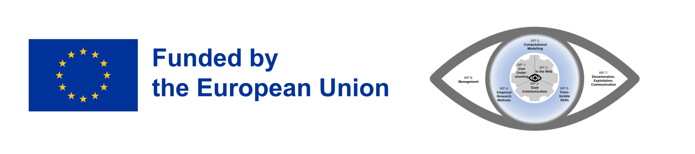

# Tobii Eye Tracker Data Recorder Python Wrapper - UEF Course Edition

This project provides a Python interface for collecting data from Tobii Eye Trackers, specifically designed for educational purposes at the University of Eastern Finland (UEF). It includes a Python bindings for Tobii SDK, allowing for efficient data collection and easy integration into Python-based research and applications within the course context.

## Educational Purpose and Usage Restrictions

**IMPORTANT:** This software is exclusively for educational use by enrolled participants of the eye-tracking course at UEF.

- Usage is strictly limited to the duration of the course.
- All collected data must be deleted after the course concludes.
- Compliance with these regulations is mandatory during all phases of software usage.

If you have any questions or concerns about the license agreement or data retention policies, please contact your course instructors or teaching assistants.

## Installation

To install this package, use pip:

```
pip install tobii_recorder
```

## Usage

After installation, you can import and use the EyeTracker class in your Python scripts. For example:

```python
from tobii_recorder import EyeTracker

# Usage example will be provided by your course instructor
```

Detailed usage instructions and examples will be provided during the course.

## License

This project is protected under a proprietary license. See the `LICENSE` file for full terms and conditions.

## Support

For inquiries about licensing, permissions, or any questions related to the use of this software within the course, please contact your course instructors or teaching assistants.

## Acknowledgments

This project has received funding from the European Union's Horizon Europe research and innovation funding program under grant agreement No 101072410, Eyes4ICU project.

<p align="center"></p>

---
Remember: This software is a learning tool. Use it responsibly and ethically, adhering to all course guidelines and data protection principles.